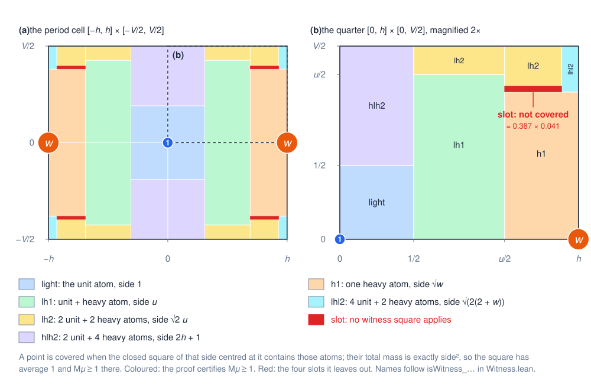

# Bounds 1.6855 and 3.879 for the planar centred maximal constant over squares

A complete Lean 4 proof, checked against Mathlib, of a new lower bound for the weak type `(1, 1)`
constant of the centred Hardy–Littlewood maximal operator over axis-parallel squares in the plane:

$$c_2 \;\ge\; \Phi = \frac{\tfrac{77 + 16\sqrt{22}}{2} - \bigl(8 + \sqrt{22} - \sqrt{70 + 8\sqrt{22}}\bigr)\bigl(11 + \sqrt{22} - 2\sqrt2 - 2\sqrt{11} - \sqrt{17 + 4\sqrt{22}}\bigr)}{26 + 4\sqrt{22}} = 1.6855099933\ldots$$

The previously published lower bound is `3/4 - √2/4 + √6/2 = 1.62119…` (Aldaz, 2000).

It also proves an upper bound below the classical one, `c₂ ≤ 3.879 < 4`, by comparing the maximal
operator with an explicit kernel, and the classical covering bound `c_d ≤ 2ᵈ` in every dimension.

## The statement

For `f : ℝᵈ → ℝ` let

$$Mf(x) = \sup_{r > 0} \frac{1}{|Q(x, r)|} \int_{Q(x, r)} |f|, \qquad Q(x, r) = \prod_{i=1}^d [x_i - r, x_i + r],$$

and let `c_d` be the least `C ∈ [0, ∞]` with `α |{Mf > α}| ≤ C ‖f‖₁` for every integrable `f` and
every `α`. `Challenge.lean` defines `maximalFunction`, `IsWeakTypeBound`, `weakTypeConstant` (= `c_d`)
and `phi` (= `Φ`) using only Mathlib, and states:

| Lean declaration | statement |
|---|---|
| `CenteredMaximal.weakTypeConstant_le_two_pow` | `c_d ≤ 2ᵈ` for every `d` |
| `CenteredMaximal.weakTypeConstant_two_le_upper` | `c₂ ≤ 3.879` |
| `CenteredMaximal.ofReal_phi_le_weakTypeConstant_two` | `Φ ≤ c₂` |
| `CenteredMaximal.lt_phi` | `1.685 < Φ` |
| `CenteredMaximal.phi_lt` | `Φ < 1.686` |

In Mathlib `Fin d → ℝ` carries the sup norm, so `Metric.closedBall x r` is exactly the cube
`Q(x, r)`. The maximal function takes values in `[0, ∞]` and the level set is measured with outer
measure, so the statement hides no regularity assumption; closed versus open cubes and strict versus
non-strict level sets give the same constant.

## The construction

Put `u = (2 + √22)/3`, the positive root of `3u² - 4u - 6 = 0`, `w = u² - 1 ≈ 3.9735`,
`h = (1 + u)/2 ≈ 1.6151` and `V = h + 1 ≈ 2.6151`. Place a mass `1` at `(ih, jV)` for even `i` and a
mass `w` for odd `i` (`i, j ∈ ℤ`):


A fundamental domain is a `2h × V` rectangle carrying mass `1 + w = u²`. On the cell
`[-h, h) × [-V/2, V/2)` the proof shows that the maximal function of this measure is at least `1`
everywhere except in four open slots of width `a ≈ 0.3868` and height `b ≈ 0.0414`:



Each coloured region is covered by one of six witness squares (`isWitness_light`, …,
`isWitness_lhl2` in `Witness.lean`): a square of side `L` centred at any point of the region
contains atoms of total mass exactly `L²`, so its average is `1`. Hence
`Φ = (2hV - 4ab)/(1 + w)`. Truncating the lattice and smearing each atom over a small square gives
integrable test functions with `C ≥ ((2N + 1)/(2N + 3))³ Φ` for every weak type bound `C`, and
`N → ∞` finishes. `docs/PROOF.md` is the informal proof with the name of each Lean declaration;
`docs/HISTORY.md` records how the configuration was found.

## The upper bound

Write `A = -|D_u| - |D_v|` for the Cauchy generator, acting on functions of the plane through its
jump (second-difference) representation, and use the diamond radius `r = |u| + |v|`. The kernel

$$K(u,v) = \frac{(R/r - 1)_+}{R - 1} - \varepsilon\,(1 - r)_+^2, \qquad R = \frac{3797}{2000},
\qquad \varepsilon = \frac{159411}{200000}$$

satisfies `K ≥ 1` on the unit diamond and `A K ≥ 0` away from the origin. The second fact is the
whole content: it reduces, after the singular part is split off as a multiple of the Cauchy
potential `1/(2π r)` (which is `A`-harmonic off the axes), to the one-variable inequality
`γ·T(r) ≤ J(2r/R)` on `(0, 1)` with `γ = εR(R-1) = 1.3596…`, proved from strong convexity and one
rational sample point (`Cauchy/Certificate.lean`). The margin comes only from `γ > 4/3`.

Given `A K ≥ 0`, the generator of `K` is a positive finite measure minus a point mass at the
origin, and an obstacle problem for `A` (`Obstacle/`) produces, for each level, an exceptional set
of controlled measure off which every dilate `K_s ∗ f` stays below the level. Since `K ≥ 1` on the
unit diamond, this dominates the maximal function, and the resulting constant is half the mass of
`K`, namely `R²/(R-1) - ε/6 = 3.8786…`. The change of variables `(u,v) ↦ (u+v, u-v)` carries
diamonds to squares.

This is a weaker constant than the `3.615749` of the manuscript this method is taken from, which
uses the fractional generator of order `6/5` and a cubic-spline kernel; only the elementary
`α = 1` case is formalized here.

## Relation to the literature

| bound on `c₂` (centred squares) | source |
|---|---|
| `≥ ((1 + √2)/2)² ≈ 1.4571` | Trinidad Menárguez and Soria, Rend. Circ. Mat. Palermo 41 (1992) |
| `≥ 3/2`, `> 1.47` | Aldaz, Czechoslovak Math. J. 50 (2000), Remark 1.3, Proposition 1.2 |
| `≥ (11 + √61)/12 ≈ 1.5675` | Melas, Ann. of Math. 157 (2003) (`c₁` exactly) with `c_{d+1} ≥ c_d` (Aldaz, 2011) |
| `≥ 3/4 - √2/4 + √6/2 ≈ 1.6212` | Aldaz (2000), Proposition 1.4 with `n = 2`: a unit rectangular lattice |
| **`≥ Φ ≈ 1.6855`** | **this repository**: a lattice with unequal masses |
| `≤ 4` | the `2ᵈ` covering bound (Tao, *245A Notes 5*, Exercise 42), formalized here |
| **`≤ 3.879`** | **this repository**: comparison with an explicit Cauchy kernel |

The compilation *Centered Hardy–Littlewood maximal constant in dimension 2*
(teorth.github.io/optimizationproblems, constant 47a, consulted 18 September 2026) lists `1.6211915`
as the best lower bound and `4` as the best upper bound. A literature search on the same day (arXiv,
citing works of Aldaz 2000 and Melas 2003, the compilation's history, GitHub, Zenodo, the Palomar
registry and others; details in `formalization.yaml`) found no lower bound above `1.6212` for
centred squares in the plane. Mathlib has no maximal-function file; the Carleson and Tau Ceti
projects contain non-sharp maximal bounds and are not used here.

## Verification

```bash
lake exe cache get
lake build CenteredMaximal Challenge Solution
```

CI builds the project, checks source hygiene (no `sorry`, `native_decide`, `Lean.ofReduceBool`,
`admit` or `axiom`; files under 1 500 lines; lines under 100 characters) and runs
[Lean Comparator](https://github.com/leanprover/comparator) on `comparator.json`. The compared
theorems depend only on `propext`, `Classical.choice` and `Quot.sound`.

## Layout

| path | content |
|---|---|
| `Challenge.lean` | definitions and statements (Mathlib imports only) |
| `Solution.lean` | the compared theorems, from the development |
| `CenteredMaximal/Statement.lean`, `Basic.lean` | the challenge definitions and their basic API |
| `CenteredMaximal/UpperBound.lean` | `c_d ≤ 2ᵈ` |
| `CenteredMaximal/Cauchy/` | the comparison kernel, its generator and the certificate |
| `CenteredMaximal/Obstacle/` | the obstacle problem for the generator |
| `CenteredMaximal/Analysis/`, `Transfer/`, `Comparison/` | jump forms, energy space, and the transfer to all scales |
| `CenteredMaximal/Numerics.lean` | `1.685 < Φ < 1.686` |
| `CenteredMaximal/Lattice/` | constants, the six witnesses, smearing, and `Φ ≤ C` |
| `docs/` | informal proof, history, figures |
| `.mathlib-quality/` | formalization plan, decomposition and ticket board |

## Authorship and AI use

The author and maintainer is Yongxi Lin. The configuration was found, certified and formalized with
AI assistance in Claude Code, under the author's direction; `formalization.yaml` records the
details. No AI system is listed as an author.

## Licence

Apache 2.0, see `LICENSE`.
