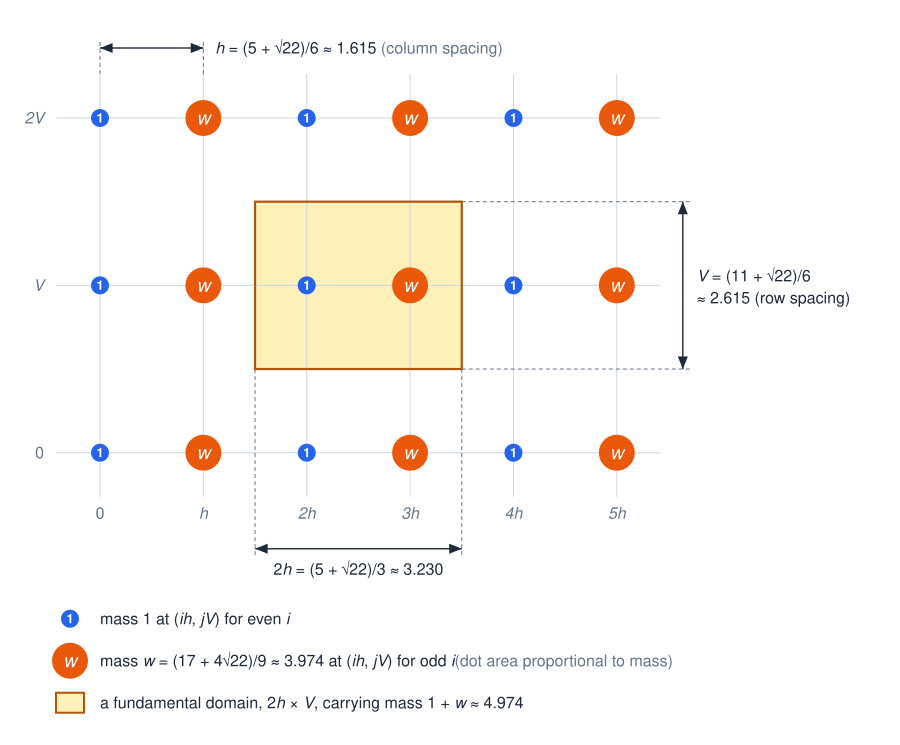

# A lower bound 1.6855 for the planar centred maximal constant over squares

This repository contains a complete Lean 4 proof, checked against Mathlib, of a new lower bound for
the weak type `(1, 1)` constant of the centred Hardy–Littlewood maximal operator over axis-parallel
squares in the plane:

$$c_2 \;\ge\; \Phi = \frac{\tfrac{77 + 16\sqrt{22}}{2} - \bigl(8 + \sqrt{22} - \sqrt{70 + 8\sqrt{22}}\bigr)\bigl(11 + \sqrt{22} - 2\sqrt2 - 2\sqrt{11} - \sqrt{17 + 4\sqrt{22}}\bigr)}{26 + 4\sqrt{22}} = 1.6855099933\ldots$$

The previously published lower bound is `3/4 - √2/4 + √6/2 = 1.62119…` (Aldaz, 2000). The
repository also proves the classical upper bound `c_d ≤ 2ᵈ` in every dimension.

## The statement

For `f : ℝᵈ → ℝ` let

$$Mf(x) = \sup_{r > 0} \frac{1}{|Q(x, r)|} \int_{Q(x, r)} |f|, \qquad Q(x, r) = \prod_{i=1}^d [x_i - r, x_i + r],$$

and let `c_d` be the least `C ∈ [0, ∞]` such that `α |{Mf > α}| ≤ C ‖f‖₁` for every integrable `f`
and every `α`. `Challenge.lean` defines `maximalFunction`, `IsWeakTypeBound`, `weakTypeConstant`
(= `c_d`) and `phi` (= `Φ`) using only Mathlib, and states:

| Lean declaration | statement |
|---|---|
| `CenteredMaximal.weakTypeConstant_le_two_pow` | `c_d ≤ 2ᵈ` for every `d` |
| `CenteredMaximal.ofReal_phi_le_weakTypeConstant_two` | `Φ ≤ c₂` |
| `CenteredMaximal.lt_phi` | `1.685 < Φ` |
| `CenteredMaximal.phi_lt` | `Φ < 1.686` |

In Mathlib `Fin d → ℝ` carries the sup norm, so `Metric.closedBall x r` is exactly the cube
`Q(x, r)`; `volume` is Lebesgue measure. The maximal function takes values in `[0, ∞]` and the level
set is not assumed measurable (its outer measure is used), so the statement makes no hidden
regularity assumptions. Closed versus open cubes and strict versus non-strict level sets give the
same constant.

## The construction

Put `u = (2 + √22)/3`, the positive root of `3u² - 4u - 6 = 0`, and

* `w = u² - 1 = (17 + 4√22)/9 ≈ 3.9735`,
* `h = (1 + u)/2 = (5 + √22)/6 ≈ 1.6151`,
* `V = h + 1 = (11 + √22)/6 ≈ 2.6151`.

Place a mass `1` at `(ih, jV)` for even `i` and a mass `w` for odd `i` (`i, j ∈ ℤ`):



Each column carries a single mass, `1` or `w`, alternating from column to column. A fundamental
domain is a `2h × V` rectangle, such as the shaded one, and carries mass `1 + w = u² ≈ 4.974`. The
Lean proof uses the translate `cell = [-h, h) × [-V/2, V/2)`, centred on a unit mass. The set where
the maximal function of this periodic measure is at least `1` covers every fundamental domain except
four thin open slots of width `a ≈ 0.3868` and height `b ≈ 0.0414`, so it has area `2hV - 4ab` per
mass `1 + w`, and `Φ = (2hV - 4ab)/(1 + w)`. Six explicit witness squares, reflected and translated,
certify the covered part; truncating the lattice and smearing each atom over a small square turns
this into integrable test functions, giving `C ≥ ((2N + 1)/(2N + 3))³ Φ` for every weak type bound
`C` and every `N`.

`docs/PROOF.md` is the informal proof, step by step and with the name of each Lean declaration;
`docs/HISTORY.md` records how the configuration was found.

## Relation to the literature

| bound on `c₂` (centred squares) | source |
|---|---|
| `≥ ((1 + √2)/2)² ≈ 1.4571` | Trinidad Menárguez and Soria, Rend. Circ. Mat. Palermo 41 (1992) |
| `≥ 3/2`, `> 1.47` | Aldaz, Czechoslovak Math. J. 50 (2000), Remark 1.3, Proposition 1.2 |
| `≥ (11 + √61)/12 ≈ 1.5675` | Melas, Ann. of Math. 157 (2003) (the exact one-dimensional constant) with `c_{d+1} ≥ c_d` (Aldaz, 2011) |
| `≥ 3/4 - √2/4 + √6/2 ≈ 1.6212` | Aldaz (2000), Proposition 1.4 with `n = 2`: a unit rectangular lattice |
| **`≥ Φ ≈ 1.6855`** | **this repository**: a lattice with unequal masses |
| `≤ 4` | the `2ᵈ` covering bound (Tao, *245A Notes 5*, Exercise 42), formalized here |

The compilation *Centered Hardy–Littlewood maximal constant in dimension 2*
(teorth.github.io/optimizationproblems, constant 47a, consulted 18 September 2026) lists `1.6211915`
as the best lower bound and `4` as the best upper bound.

**Novelty.** A literature search on 18 September 2026 covered arXiv (about 15 API queries), the
works citing Aldaz (2000) and Melas (2003) in Semantic Scholar, the full history of the compilation's
constant-47a page with all its issues, pull requests and 88 forks, a GitHub-wide code search, Zenodo,
Hugging Face, Figshare, the Palomar registry, Epoch's FrontierMath open problems, erdosproblems.com,
MathOverflow and google-deepmind/formal-conjectures. No lower bound above `1.6212` for centred squares
in the plane was found, and none of `1.66856`, `1.6855` or `(17 + 4√22)/9` occurs. The most recent
AI-driven work on the centred constant (AlphaEvolve, arXiv:2511.02864; arXiv:2608.23691) concerns
dimension one only. The search could not reach OpenAlex's citation index (rate-limited), zbMATH's
cited-by pages or paywalled full texts, so novelty is asserted only on the basis of this search.

**Previous formalizations.** Mathlib has no maximal-function file. The Carleson project formalizes an
uncentred maximal function with a non-sharp weak type bound, and Tau Ceti a centred maximal function
over balls with the bound `4ⁿ`. No Lean statement of the sharp constant `c_d` or of a lower bound for
it was found. This development does not depend on either project.

## Verification

```bash
lake exe cache get
lake build CenteredMaximal Challenge Solution
```

The CI workflow (`.github/workflows/build.yml`) builds the project, checks source hygiene (no `sorry`
in the development, no `native_decide`, `Lean.ofReduceBool`, `admit` or `axiom`, files under 1 500
lines, lines under 100 characters), and runs [Lean Comparator](https://github.com/leanprover/comparator)
inside its `landrun` sandbox on `comparator.json`. The compared theorems depend only on `propext`,
`Classical.choice` and `Quot.sound`.

## Layout

| path | content |
|---|---|
| `Challenge.lean` | definitions and statements (Mathlib imports only) |
| `Solution.lean` | the compared theorems, from the development |
| `CenteredMaximal/Statement.lean` | the challenge definitions, repeated verbatim |
| `CenteredMaximal/Basic.lean` | basic API for the maximal function and the constant |
| `CenteredMaximal/UpperBound.lean` | `c_d ≤ 2ᵈ` |
| `CenteredMaximal/Numerics.lean` | `1.685 < Φ < 1.686` |
| `CenteredMaximal/Lattice/Constants.lean` | `u`, `w`, `h`, `V`, witness sides, the slot, `Φ = (2hV - 4ab)/(1 + w)` |
| `CenteredMaximal/Lattice/Witness.lean` | the six witnesses and the coverage of the period cell |
| `CenteredMaximal/Lattice/Smear.lean` | the smeared lattice: integrability, `L¹` norm, maximal function |
| `CenteredMaximal/Lattice/LowerBound.lean` | disjoint copies in the level set and `Φ ≤ C` |
| `docs/` | informal proof and history |
| `.mathlib-quality/` | formalization plan, decomposition and ticket board |

## Authorship and AI use

The author and maintainer is Yongxi Lin. The configuration was found, certified and formalized with
AI assistance in Claude Code (models `claude-fable-5-1` for the search and certificate,
`claude-opus-5` for the Lean development), under the author's direction; `formalization.yaml`
records the details. No AI system is listed as an author.

## Licence

Apache 2.0, see `LICENSE`.
