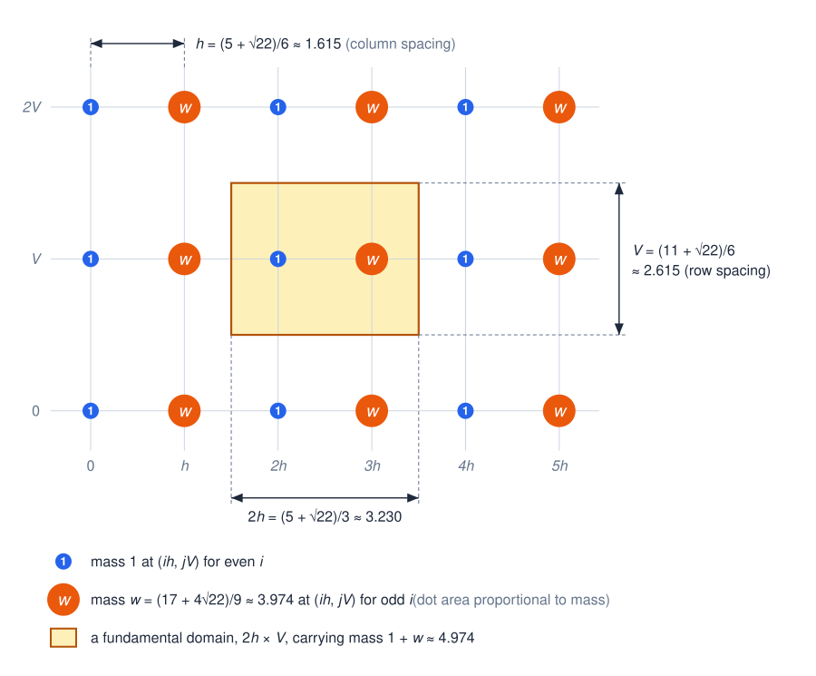
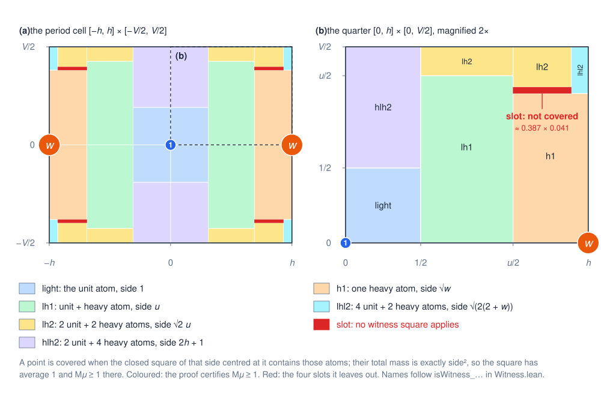

# Centred maximal constants for squares and Euclidean balls

A complete Lean 4 proof, checked against Mathlib, of a new lower bound for the weak type `(1, 1)`
constant of the centred Hardy–Littlewood maximal operator over axis-parallel squares in the plane:

$$c_2 \;\ge\; \Phi = \frac{\tfrac{77 + 16\sqrt{22}}{2} - \bigl(8 + \sqrt{22} - \sqrt{70 + 8\sqrt{22}}\bigr)\bigl(11 + \sqrt{22} - 2\sqrt2 - 2\sqrt{11} - \sqrt{17 + 4\sqrt{22}}\bigr)}{26 + 4\sqrt{22}} = 1.6855099933\ldots$$

The previously published lower bound is `3/4 - √2/4 + √6/2 = 1.62119…` (Aldaz, 2000).

It also proves an upper bound below the classical one, `c₂ ≤ 3.879 < 4`, by comparing the maximal
operator with an explicit kernel, and the classical covering bound `c_d ≤ 2ᵈ` in every dimension.

## Euclidean ball bounds

The separate definitions `ballMaximalFunction`, `IsBallWeakTypeBound`, and
`ballWeakTypeConstant` use `EuclideanSpace ℝ (Fin n)` and its Euclidean norm. Thus their averaging
sets are Euclidean balls, whereas the original `weakTypeConstant` continues to describe cubes.
The ball theorems prove

$$c^{\mathrm{ball}}_2 \le e, \qquad
  c^{\mathrm{ball}}_n \le (n/2)^{n/(n-2)} \quad (n \ge 3).$$

These are stated in `Challenge.lean` and proved in `Solution.lean` as
`ballWeakTypeConstant_two_le_exp` and `ballWeakTypeConstant_le_rpow`. The proof follows the
[disc maximal constant manuscript](https://claude.ai/artifact/H4Kdhs9dPAcGmEtzwkJ65a):
it uses a Dirichlet obstacle problem and a logarithmic or Newtonian Green kernel.

The Lean development now proves the kernel calculations needed by that argument. Both kernels
dominate the unit ball, their support radii are checked, and their masses are exact:

$$\int_{\mathbb R^2} K_2(x)\,dx = \pi e, \qquad
  \int_{\mathbb R^n} K_n(x)\,dx = C_n\,|B(0,1)| \quad(n\ge3),$$

where the coefficient is

$$C_n=(n/2)^{n/(n-2)}.$$

The same normalized mass is proved at every centre and positive scale.
`Ball/ObstacleTransfer.lean` formalizes the three-radius argument: an obstacle contact
set, a capped density, and local Green comparison imply the level-set estimate. It also supplies
the contact-set measure lemma, a radius cutoff from integrability, and an almost-everywhere
density variant. `Ball/ObstacleCriterion.lean` packages these ingredients into the weak type
estimate for smooth nonnegative compactly supported functions. `Ball/SmoothReduction.lean`
proves that any such estimate extends to every integrable function: it approximates the square
root of the absolute value in `L²`, squares the approximant, and passes to level sets by a
lower-limit argument. `Ball/PairingComparison.lean` turns a signed Green pairing into the
nonnegative-kernel inequality needed by the certificate. `Ball/GreenIdentity.lean` establishes
the planar and Newtonian radial profile derivatives, their constant flux, and a general polar
integration formula for Euclidean balls.
`Ball/RadialGreenCalculus.lean` proves the finite-annulus integration-by-parts identity for
both Green profiles from the cumulative Laplacian mass and spherical-mean flux relation.
`Ball/RadialMassDerivative.lean` proves that the derivative of a smooth compactly supported
density's mass inside a ball is its spherical integral times the polar Jacobian.
`Ball/CenterLimits.lean` controls the inner boundary terms, and `Ball/RadialGreenLimit.lean`
passes the planar and Newtonian identities to the full interval from the center.
`Ball/DirectCertificate.lean` accepts a direct bound on the contact-set measure. It removes
the need to prove a total-mass estimate for the capped density; the obstacle variational
inequality can instead be tested with a truncation.
`Ball/ContactTruncation.lean` proves that these truncation inequalities imply the direct
contact-set bound, including the extended-real integral form used by the certificate.
`Ball/PlanarGreenPairing.lean` proves differentiation of a circle average with respect to its
radius and a planar polar formula for disk integrals. `Ball/ObstacleExistence.lean` proves an
abstract Hilbert-space minimizer and its
variational inequality, and connects a positive cone to the concrete `H¹₀` space in
`Ball/DirichletH01.lean`. The latter is adapted, with its original attribution and Apache 2.0
license, from [EllipticPDE](https://github.com/alejandro-soto-franco/EllipticPDE) at the
revision documented in the file. `Ball/ChallengeReduction.lean` states the two requested bounds
as consequences of the respective obstacle certificates, with all other reductions discharged.
`Ball/DirichletPoincareOneDim.lean` through `Ball/DirichletPoincareBounded.lean` establish
the Poincaré inequality on arbitrary bounded domains by one dimensional slices, Fubini,
box transport, and density. `Ball/DirichletForm.lean` defines the pure gradient form,
and the bounded-domain result now proves its coercivity on a ball.
`Ball/MonotoneSurjectivity.lean` proves solvability of strongly monotone Lipschitz Hilbert
equations. `Ball/L2Penalty.lean` applies this to the negative-part penalty, and
`Ball/BallPenalized.lean` constructs a solution of the penalized weak Dirichlet equation on a
ball. `Ball/BallPenaltyCap.lean` proves its negative-part density is uniformly capped by
the obstacle level, using a shifted Sobolev positive-part test.
`Ball/BallFlux.lean` proves the exact ball flux identity needed by the Green calculation.
The Green pairing is proved at arbitrary radii for smooth compact test functions.
`Ball/BallPenaltyLimit.lean` and `Ball/BallPenaltyVariational.lean` now construct a common weak
limit of capped penalized solutions and prove that it satisfies the obstacle variational
inequality. `Ball/ObstacleContact.lean` obtains the contact-set mass bound from that limit.
`Ball/BallComplementCertificate.lean` packages the correct comparison density: the cap minus
the nonnegative penalty density. It is nonnegative, bounded by the cap, and occurs with the
right sign in the weak equation.

`Ball/BallWeakDistribution.lean` derives the local distributional Laplacian from the weak
equation. `Ball/BallPositiveRepresentative.lean` supplies a nonnegative integrable,
compactly supported representative that vanishes outside the contact set. One cutoff contains
the support of every relevant Green kernel (`Ball/BallKernelSupport.lean`).

`Ball/LocalMollifierDistribution.lean` identifies the Laplacian of a mollification with the
mollified local density. `Ball/BallPositiveMollifierPackage.lean` constructs one sequence of
smooth nonnegative compactly supported obstacles whose Laplacians have a common interior bound
and converge almost everywhere to the density. The Green identity then gives a nonnegative
pairing outside the contact set at almost every center, simultaneously for all radii
(`Ball/AEGreenFromMollifiers.lean` and `Ball/BallComplementGreenPairing.lean`).
`Ball/BallComplementKernelComparison.lean` converts that real pairing into the extended-real
kernel comparison. `Ball/BallGreenCertificates.lean` assembles the planar and Newtonian
certificates. `Ball/AEObstacleTransfer.lean`, `Ball/AERealCertificate.lean`, and
`Ball/AEChallengeReduction.lean` transfer them to the two optimal weak type bounds. The final
theorems are in `Solution.lean`.

## The statement

For `f : ℝᵈ → ℝ` let

$$Mf(x) = \sup_{r > 0} \frac{1}{|Q(x, r)|} \int_{Q(x, r)} |f|, \qquad Q(x, r) = \prod_{i=1}^d [x_i - r, x_i + r],$$

and let `c_d` be the least `C ∈ [0, ∞]` with `α |{Mf > α}| ≤ C ‖f‖₁` for every integrable `f` and
every `α`. `Challenge.lean` defines `maximalFunction`, `IsWeakTypeBound`, `weakTypeConstant` (= `c_d`)
and `phi` (= `Φ`) using only Mathlib, and states:

| Lean declaration | statement |
|---|---|
| `CenteredMaximal.weakTypeConstant_le_two_pow` | `c_d ≤ 2ᵈ` for every `d` |
| `CenteredMaximal.weakTypeConstant_two_le_upper` | `c₂ ≤ 3.879` |
| `CenteredMaximal.ofReal_phi_le_weakTypeConstant_two` | `Φ ≤ c₂` |
| `CenteredMaximal.lt_phi` | `1.685 < Φ` |
| `CenteredMaximal.phi_lt` | `Φ < 1.686` |
| `CenteredMaximal.ballWeakTypeConstant_two_le_exp` | $$c^{\mathrm{ball}}_2 \le e$$ |
| `CenteredMaximal.ballWeakTypeConstant_le_rpow` | $$c^{\mathrm{ball}}_n \le (n/2)^{n/(n-2)}$$ for $$n\ge3$$ |

In Mathlib `Fin d → ℝ` carries the sup norm, so `Metric.closedBall x r` is exactly the cube
`Q(x, r)`. The maximal function takes values in `[0, ∞]` and the level set is measured with outer
measure, so the statement hides no regularity assumption; closed versus open cubes and strict versus
non-strict level sets give the same constant.

## The construction

Put `u = (2 + √22)/3`, the positive root of `3u² - 4u - 6 = 0`, `w = u² - 1 ≈ 3.9735`,
`h = (1 + u)/2 ≈ 1.6151` and `V = h + 1 ≈ 2.6151`. Place a mass `1` at `(ih, jV)` for even `i` and a
mass `w` for odd `i` (`i, j ∈ ℤ`):



A fundamental domain is a `2h × V` rectangle carrying mass `1 + w = u²`. On the cell
`[-h, h) × [-V/2, V/2)` the proof shows that the maximal function of this measure is at least `1`
everywhere except in four open slots of width `a ≈ 0.3868` and height `b ≈ 0.0414`:



Each coloured region is covered by one of six witness squares (`isWitness_light`, …,
`isWitness_lhl2` in `Witness.lean`): a square of side `L` centred at any point of the region
contains atoms of total mass exactly `L²`, so its average is `1`. Hence
`Φ = (2hV - 4ab)/(1 + w)`. Truncating the lattice and smearing each atom over a small square gives
integrable test functions with `C ≥ ((2N + 1)/(2N + 3))³ Φ` for every weak type bound `C`, and
`N → ∞` finishes. `docs/PROOF.md` is the informal proof with the name of each Lean declaration;
`docs/HISTORY.md` records how the configuration was found.

## The upper bound

Write `A = -|D_u| - |D_v|` for the Cauchy generator, acting on functions of the plane through its
jump (second-difference) representation, and use the diamond radius `r = |u| + |v|`. The kernel

$$K(u,v) = \frac{(R/r - 1)_+}{R - 1} - \varepsilon\,(1 - r)_+^2, \qquad R = \frac{3797}{2000},
\qquad \varepsilon = \frac{159411}{200000}$$

satisfies `K ≥ 1` on the unit diamond and `A K ≥ 0` away from the origin. The second fact is the
whole content: it reduces, after the singular part is split off as a multiple of the Cauchy
potential `1/(2π r)` (which is `A`-harmonic off the axes), to the one-variable inequality
`γ·T(r) ≤ J(2r/R)` on `(0, 1)` with `γ = εR(R-1) = 1.3596…`, proved from strong convexity and one
rational sample point (`Cauchy/Certificate.lean`). The margin comes only from `γ > 4/3`.

Given `A K ≥ 0`, the generator of `K` is a positive finite measure minus a point mass at the
origin, and an obstacle problem for `A` (`Obstacle/`) produces, for each level, an exceptional set
of controlled measure off which every dilate `K_s ∗ f` stays below the level. Since `K ≥ 1` on the
unit diamond, this dominates the maximal function, and the resulting constant is half the mass of
`K`, namely `R²/(R-1) - ε/6 = 3.8786…`. The change of variables `(u,v) ↦ (u+v, u-v)` carries
diamonds to squares.

## Relation to the literature

| bound on `c₂` (centred squares) | source |
|---|---|
| `≥ ((1 + √2)/2)² ≈ 1.4571` | Trinidad Menárguez and Soria, Rend. Circ. Mat. Palermo 41 (1992) |
| `≥ 3/2`, `> 1.47` | Aldaz, Czechoslovak Math. J. 50 (2000), Remark 1.3, Proposition 1.2 |
| `≥ (11 + √61)/12 ≈ 1.5675` | Melas, Ann. of Math. 157 (2003) (`c₁` exactly) with `c_{d+1} ≥ c_d` (Aldaz, 2011) |
| `≥ 3/4 - √2/4 + √6/2 ≈ 1.6212` | Aldaz (2000), Proposition 1.4 with `n = 2`: a unit rectangular lattice |
| **`≥ Φ ≈ 1.6855`** | **this repository**: a lattice with unequal masses |
| `≤ 4` | the `2ᵈ` covering bound (Tao, *245A Notes 5*, Exercise 42), formalized here |
| **`≤ 3.879`** | **this repository**: comparison with an explicit Cauchy kernel |

The compilation *Centered Hardy–Littlewood maximal constant in dimension 2*
(teorth.github.io/optimizationproblems, constant 47a, consulted 18 September 2026) lists `1.6211915`
as the best lower bound and `4` as the best upper bound. A literature search on the same day (arXiv,
citing works of Aldaz 2000 and Melas 2003, the compilation's history, GitHub, Zenodo, the Palomar
registry and others; details in `formalization.yaml`) found no lower bound above `1.6212` for
centred squares in the plane. Mathlib has no maximal-function file; the Carleson and Tau Ceti
projects contain non-sharp maximal bounds and are not used here.

## Verification

```bash
lake exe cache get
lake build CenteredMaximal Challenge Solution
```

CI builds the project, checks source hygiene (no `native_decide`, `Lean.ofReduceBool`,
`admit` or `axiom` declarations; files under 1 500 lines; lines under 100 characters) and runs
[Lean Comparator](https://github.com/leanprover/comparator) on `comparator.json`. The compared
theorems depend only on `propext`, `Classical.choice` and `Quot.sound`.

## Layout

| path | content |
|---|---|
| `Challenge.lean` | definitions and statements (Mathlib imports only) |
| `Solution.lean` | the compared theorems, from the development |
| `CenteredMaximal/Statement.lean`, `Basic.lean` | the challenge definitions and their basic API |
| `CenteredMaximal/Ball/Basic.lean` | the basic API for Euclidean ball averages |
| `CenteredMaximal/Ball/Constants.lean` | the planar and higher-dimensional radius identities |
| `CenteredMaximal/Ball/Comparison.lean` | reduction from a kernel maximal bound to ball averages |
| `CenteredMaximal/Ball/GreenKernel.lean` | Green kernels and their pointwise bounds |
| `CenteredMaximal/Ball/PlanarMass.lean`, `PlanarNormalized.lean` | exact planar Green mass at every scale |
| `CenteredMaximal/Ball/NewtonianMass.lean` | exact higher-dimensional Green mass at every scale |
| `CenteredMaximal/Ball/KernelScaling.lean` | Euclidean scaling and translation of kernel mass |
| `CenteredMaximal/Ball/ObstacleTransfer.lean` | three-radius level-set argument from an obstacle certificate |
| `CenteredMaximal/Ball/ObstacleCriterion.lean` | smooth weak type estimate from obstacle certificates |
| `CenteredMaximal/Ball/SmoothReduction.lean` | nonnegative smooth approximation and transfer to all `L¹` inputs |
| `CenteredMaximal/Ball/PairingComparison.lean` | signed Green pairing to kernel comparison |
| `CenteredMaximal/Ball/GreenIdentity.lean` | radial Green profiles, flux, and polar integration |
| `CenteredMaximal/Ball/PlanarGreenPairing.lean` | radius derivative of circle averages |
| `CenteredMaximal/Ball/DirichletH01.lean` | adapted Hilbert space of weak derivatives with zero trace |
| `CenteredMaximal/Ball/DirichletPoincareDensity.lean`, `DirichletPoincareOneDim.lean` | Poincaré steps |
| `CenteredMaximal/Ball/DirichletForm.lean` | pure gradient form and conditional coercivity |
| `CenteredMaximal/Ball/ObstacleExistence.lean` | abstract convex obstacle minimizer |
| `CenteredMaximal/Ball/ContactTruncation.lean` | direct contact mass from variational truncations |
| `CenteredMaximal/Ball/MonotoneSurjectivity.lean`, `L2Penalty.lean`, `BallPenalized.lean` | penalized weak equation on a ball |
| `CenteredMaximal/Ball/L2PenaltyCap.lean`, `BallPenaltyCap.lean` | uniform cap for penalized density |
| `CenteredMaximal/Ball/BallFlux.lean` | exact ball divergence identity |
| `CenteredMaximal/Ball/BallComplementCertificate.lean` | weak obstacle and capped complementary density |
| `CenteredMaximal/Ball/BallPositiveMollifierPackage.lean` | bounded smooth approximations of the weak obstacle |
| `CenteredMaximal/Ball/BallComplementGreenPairing.lean` | almost-everywhere Green pairing for all radii |
| `CenteredMaximal/Ball/BallGreenCertificates.lean` | direct certificates for planar and Newtonian kernels |
| `CenteredMaximal/Ball/FinalReduction.lean`, `ChallengeReduction.lean` | conditional bounds for the optimal ball constant |
| `CenteredMaximal/UpperBound.lean` | `c_d ≤ 2ᵈ` |
| `CenteredMaximal/Cauchy/` | the comparison kernel, its generator and the certificate |
| `CenteredMaximal/Obstacle/` | the obstacle problem for the generator |
| `CenteredMaximal/Analysis/`, `Transfer/`, `Comparison/` | jump forms, energy space, and the transfer to all scales |
| `CenteredMaximal/Numerics.lean` | `1.685 < Φ < 1.686` |
| `CenteredMaximal/Lattice/` | constants, the six witnesses, smearing, and `Φ ≤ C` |
| `docs/` | informal proof, history, figures |
| `.mathlib-quality/` | formalization plan, decomposition and ticket board |

## Authorship and AI use

The author and maintainer is Yongxi Lin. The configuration was found, certified and formalized with
AI assistance in Claude Code, under the author's direction; `formalization.yaml` records the
details. No AI system is listed as an author.

## Licence

Apache 2.0, see `LICENSE`.
